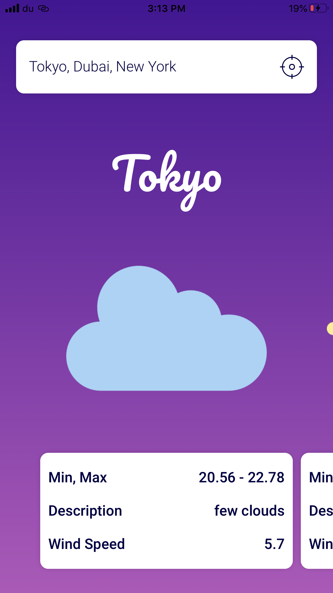
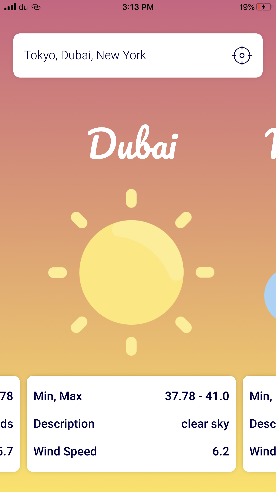
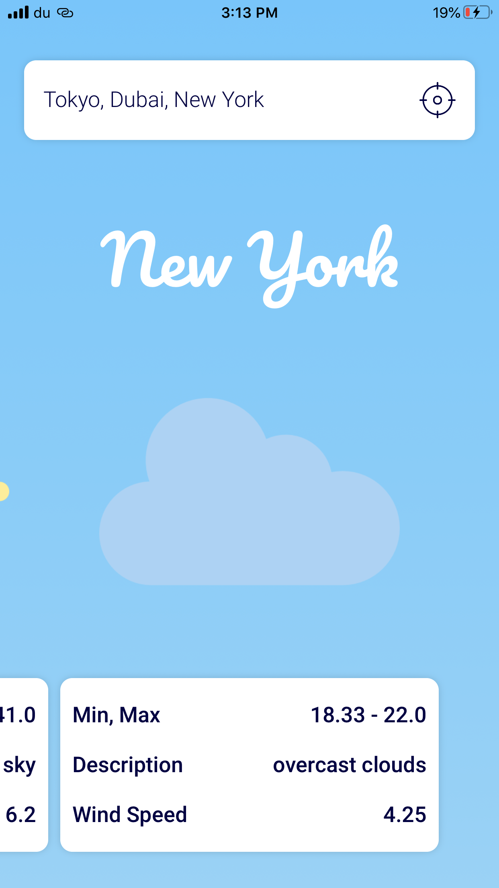
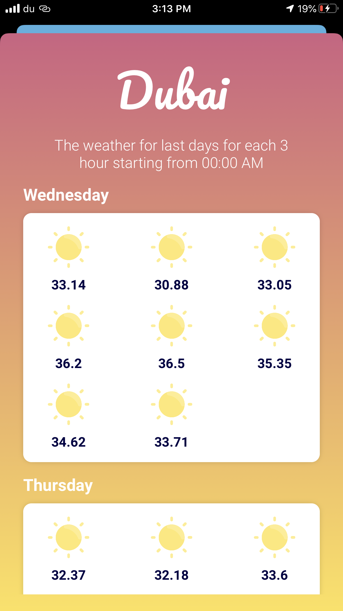
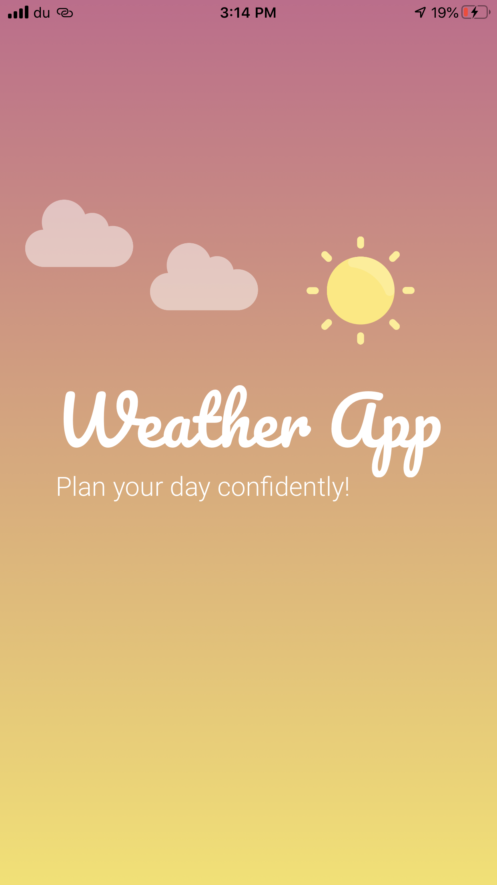
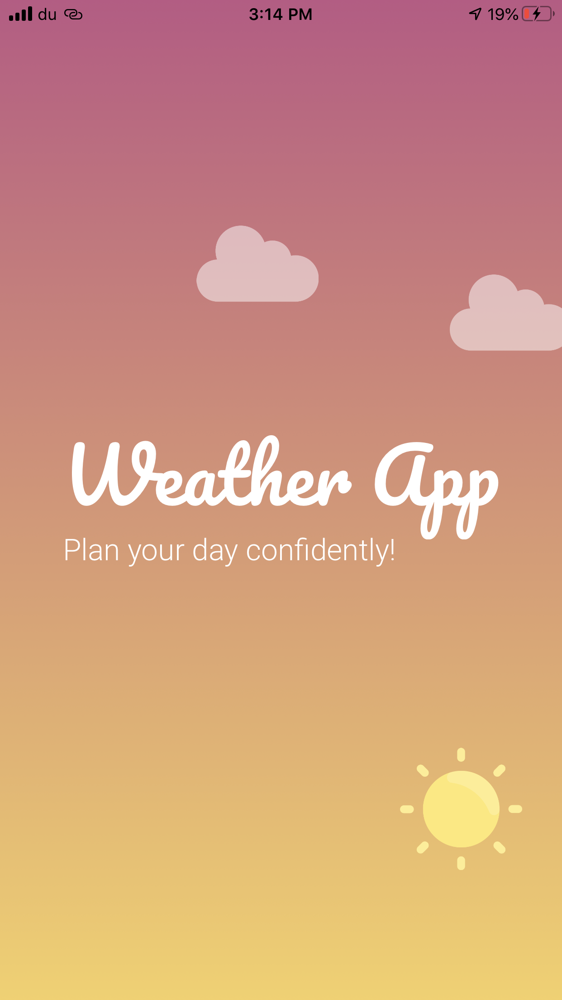

<p align="center">
  </center>
</p>

Weather app, an app to give you the latest weather forecast built using MVVM architecture with RxSwift and Swinject.

## Screenshots

<table>
  <tbody>
    <tr>
      <th></th>
      <th></th>
      <th></th>
      <th></th>
      <th></th>
      <th></th>
    </tr>
  </tbody>
</table>

## How to get up and runing

- Clone the app.
- Add new file to the `Constants` folder with a `Keys.swift` name, The content of the file should be your `apiKey`
as a `UInt8` array as below:

``` Swift
import Foundation

enum Keys {

  ///
  /// Open weather API key as `[UInt8]`.
  ///
  static let apiKey: [UInt8] = []

}

```

To generate this key, use the `Obfuscator` class.

``` Swift
print(Obfuscator.obfuscate("your_key", Constants.strings.key))
```

Take the array printed and replace it with your apiKey value.

``` Swift
import Foundation

enum Keys {

  ///
  /// Open weather API key as `[UInt8]`.
  ///
  static let apiKey: [UInt8] = [28, 64, 89, 15, 4, etc...]

}

```

- Run the app 🚀.

## Run the app tests

TODO

## Dependencies

- RxSwift.
- Swinject.
- SwinjectAutoRegistration.
- RxCoreLocation.

## License

``` Text
The MIT License (MIT)

Copyright (c) 2020 Abedalkareem

Permission is hereby granted, free of charge, to any person obtaining a copy
of this software and associated documentation files (the "Software"), to deal
in the Software without restriction, including without limitation the rights
to use, copy, modify, merge, publish, distribute, sublicense, and/or sell
copies of the Software, and to permit persons to whom the Software is
furnished to do so, subject to the following conditions:

The above copyright notice and this permission notice shall be included in all
copies or substantial portions of the Software.

THE SOFTWARE IS PROVIDED "AS IS", WITHOUT WARRANTY OF ANY KIND, EXPRESS OR
IMPLIED, INCLUDING BUT NOT LIMITED TO THE WARRANTIES OF MERCHANTABILITY,
FITNESS FOR A PARTICULAR PURPOSE AND NONINFRINGEMENT. IN NO EVENT SHALL THE
AUTHORS OR COPYRIGHT HOLDERS BE LIABLE FOR ANY CLAIM, DAMAGES OR OTHER
LIABILITY, WHETHER IN AN ACTION OF CONTRACT, TORT OR OTHERWISE, ARISING FROM,
OUT OF OR IN CONNECTION WITH THE SOFTWARE OR THE USE OR OTHER DEALINGS IN THE
SOFTWARE.
```